# Casshius Bratton-Bey - Network Infrastructure Lab

## Table of Contents
- [Overview](#overview)
- [Network Architecture](#network-architecture)
- [Cisco Lab Experience](#cisco-lab-experience)
- [Core Infrastructure](#core-infrastructure)
- [Service Integration Experiments](#service-integration-experiments)
- [Contact](#contact)

---

## Overview

I Built a production-style network infrastructure lab to demonstrate practical networking skills beyond certification. The environment features three-tier VLAN segmentation, Cisco routing/switching configurations, pfSense firewall, Active Directory, and monitoring - complemented by 70+ Cisco Packet Tracer labs.

---

## Network Architecture

**Three-Tier VLAN Design with Zero Trust Access**

**Design:**
- VLAN 1011 (Public) - Internet-facing services, Cloudflare Tunnel endpoint
- VLAN 1010 (Application) - Web services, admin access, file services
- VLAN 1012 (Data) - Backend services, databases, authentication

**Routing:** pfSense handles inter-VLAN routing with firewall rules controlling traffic between security zones.

**External Access:** Cloudflare Zero Trust with MFA, eliminating exposed ports

---

## Cisco Lab Experience

Completed 70+ Cisco Packet Tracer labs demonstrating hands-on proficiency with Cisco IOS configuration and enterprise networking concepts.

### Routing Protocols
- **OSPF:** Single-area and multi-area configurations, cost manipulation, DR/BDR election, ABR setup
- **EIGRP:** Metric tuning, load balancing, variance configuration
- **BGP:** Basic eBGP peering and route advertisement
- **Static Routing:** Default routes, floating static routes, summarization

### Switching Technologies  
- **VLANs:** Creation, assignment, verification, troubleshooting
- **Trunking:** 802.1Q configuration, native VLAN management
- **Spanning Tree:** PVST+, Rapid PVST+, root bridge election, PortFast, BPDU Guard
- **EtherChannel:** LACP and PAgP configuration, load distribution
- **Inter-VLAN Routing:** Router-on-a-stick, Layer 3 switching (SVI)

### Security & Access Control
- **ACLs:** Standard and Extended ACLs (numbered/named), placement best practices
- **Port Security:** MAC limiting, violation modes, sticky MAC addresses
- **DHCP Snooping:** Trusted/untrusted ports, rate limiting
- **Dynamic ARP Inspection:** ARP packet validation

### Network Services
- **DHCP:** Server configuration, relay agents, exclusions
- **NAT/PAT:** Static NAT, dynamic NAT, PAT/overload
- **NTP:** Time synchronization configuration

---

## Core Infrastructure

### Firewall & Routing
**Platform:** pfSense (open-source firewall/router)

**Configuration:**
- Three-tier VLAN segmentation with inter-VLAN routing
- Firewall rules enforcing security policies between zones
- Network segmentation: Public (outbound only), App (controlled inbound), Data (protected backend)

### Active Directory
**Platform:** Samba AD (Linux-based Active Directory implementation)

**Features:**
- Centralized authentication and user management
- LDAP integration for network services
- Kerberos realm for secure authentication
- Group-based access control across infrastructure

### DNS Services
**Platform:** BIND9

**Configuration:**
- Internal zone management (lab.brattonlabs.org)
- Split-horizon DNS for internal vs external resolution
- Zone forwarding to Active Directory for domain queries
- Demonstrated understanding of DNS dependencies for network services

### Network Monitoring
**Platform:** Zabbix

**Implementation:**
- Monitoring of all network devices and servers
- SNMP integration for device metrics
- Service availability tracking
- Performance baseline establishment
- PostgreSQL database backend for metrics storage

---

## Service Integration Experiments

*To better understand how applications depend on network infrastructure, I deployed several services to observe authentication flows, service dependencies, and troubleshooting across the stack.*

### File Services (SFTP & Web-Based Access)
**Purpose:** Understand how file transfer services integrate with directory services and network security

**What I Learned:**
- LDAP authentication integration with Linux services using Kerberos
- Network connectivity requirements (ports, protocols, firewall rules)
- Troubleshooting multi-layer issues (network → auth → application)
- How chroot jails and SELinux affect service access

### Web Application Hosting
**Purpose:** Learn how web services depend on network infrastructure

**What I Learned:**
- Reverse proxy configuration (nginx) and port forwarding
- How applications authenticate against LDAP/Active Directory
- Database connectivity requirements across VLANs
- Firewall rules needed for application-to-database communication

### Email Infrastructure (Mailcow)
**Purpose:** Understand complex service dependencies and DNS requirements

**What I Learned:**
- Email relies heavily on proper DNS configuration (MX, SPF, DMARC records)
- LDAP integration for user authentication
- How services span multiple network layers
- Troubleshooting methodology when multiple systems interact

**Key Takeaway:** These experiments reinforced that network engineers need to understand how applications depend on network services (DNS, connectivity, firewall rules, authentication) even if they don't manage the applications themselves. When users report "the email is down," network teams need to understand if it's a network issue, DNS problem, or application failure.

---

## Contact

📧 casshiusbb42@gmail.com  
💼 [LinkedIn](https://linkedin.com/in/casshius-b-md)  
📄 [Resume (PDF)](Casshius-Bratton-Bey-Resume-2025.pdf)

---

*Built to demonstrate practical networking skills and understanding of enterprise infrastructure.*
